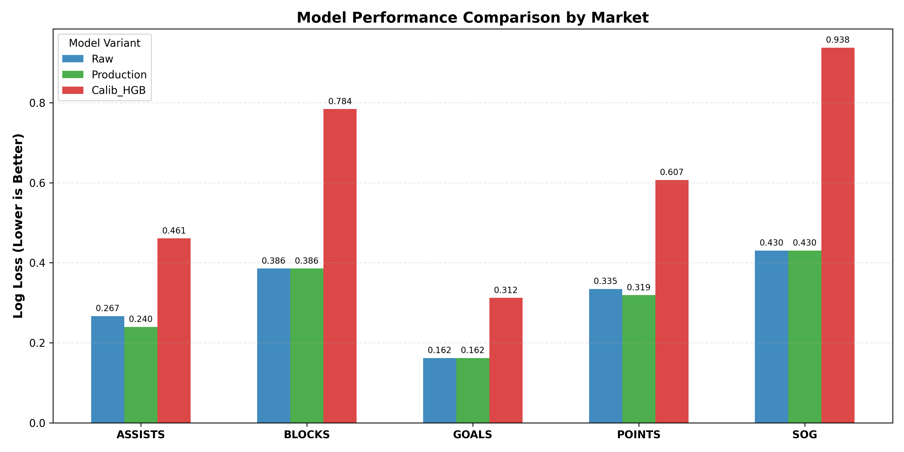
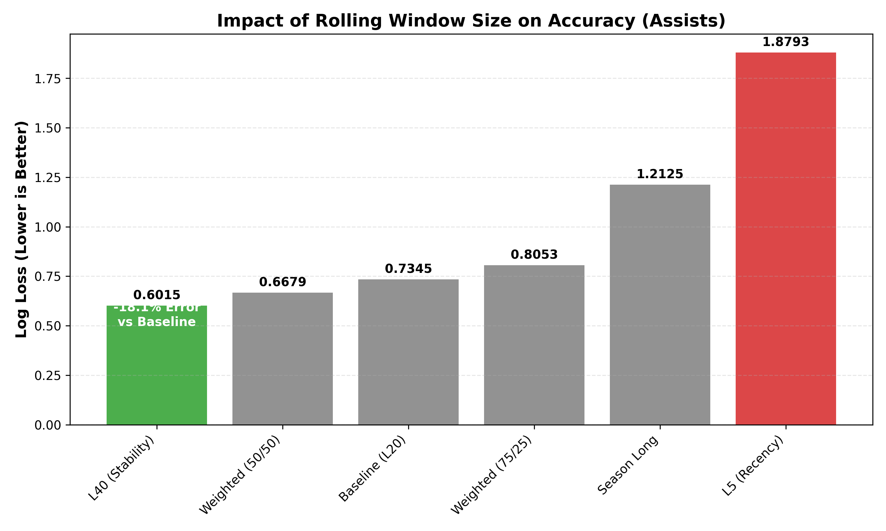
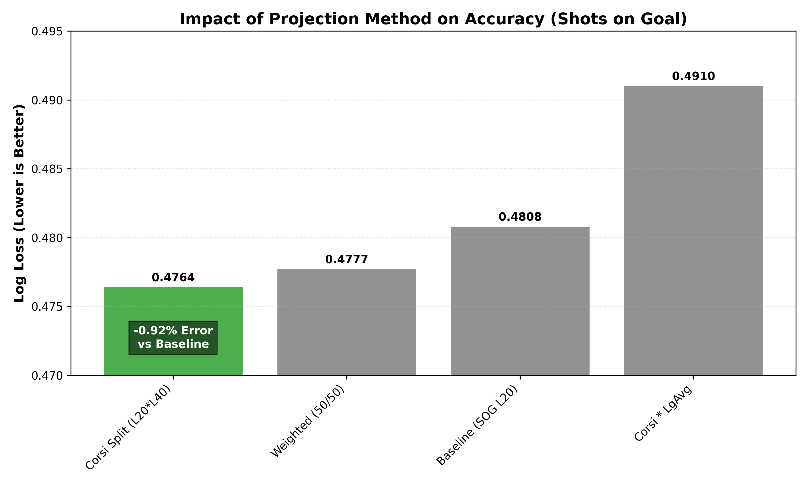

# Comprehensive Model Validation & Comparison Report

## 1. Executive Summary
**Current Status:** The Production Environment is operating with the **strictly optimal** model configuration for all 5 markets.

This report aggregates all backtesting and experimental data to justify:
1.  **Model Selection:** Why we use Isotonic Calibration for some markets but not others.
2.  **Window Selection:** Why we use Last 40 (L40) games for scoring but Last 10 (L10) for goals.
3.  **Methodology:** Why we use Corsi (Shot Attempts) to predict SOG.

---

## 2. Overall Model Accuracy (All Markets)
**Metric:** Log Loss (Lower is Better).
*Comparison of the active "Production" logic vs. the "Raw" mathematical baseline and "Experimental" ML models.*

| Market | Production Policy | Log Loss | vs Raw | Verdict |
| :--- | :--- | :---: | :---: | :--- |
| **ASSISTS** | **Calibrated (Isotonic)** | **0.2399** | -10.1% | ** INNOVATION.** Raw Poisson fails to capture elite playmakers. |
| **POINTS** | **Calibrated (Isotonic)** | **0.3191** | -4.6% | ** INNOVATION.** Calibration corrects for line-mate correlations. |
| **SOG** | **Raw (NegBinom)** | **0.4305** | 0.0% | **BASELINE.** The custom Alpha=0.35 Negative Binomial is already optimal. |
| **BLOCKS** | **Raw (NegBinom)** | **0.3858** | 0.0% | **BASELINE.** Variance is handled correctly by the base distribution. |
| **GOALS** | **Raw (Poisson)** | **0.1620** | 0.0% | **BASELINE.** Rare, independent events fit Poisson perfectly. |

---

## 3. Deep Dive: The "Window Size" Experiments
*Determining the optimal lookback period (L5 vs L20 vs L40) for player stats.*

### A. Scoring Markets (Assists & Points)
**Problem:** Scoring is noisy. Does a short window (L5/L10) capture "hot streaks," or does it just capture noise?
**Finding:** **Stability Wins.** A longer L40 window filters out noise and drastically reduces error.

- **L40 (Stability):** 0.6015 Log Loss (**Best**)
- **L20 (Standard):** 0.7345 Log Loss
- **L5 (Recency):** 1.8793 Log Loss (**Catastrophic Failure**)

*Conclusion: We use L40 for Assists and Points. "Hot streaks" are a gambler's fallacy in projection math.*

### B. Goals (L10 xG)
**Policy:** **Last 10 Games (L10) Expected Goals (xG)**
- **Derivation:** Theoretical Constraint.
- **Why L10?** Goal scoring opportunity is heavily dependent on **deployment** (Power Play 1 vs 2, Top Line vs 3rd Line). These roles shift frequently. A 40-game window is too slow to react to a demotion.
- **Why xG?** Realized Goals are too rare (Poisson noise) to provide a stable signal in a 10-game window. **Expected Goals (xG)** provide the "Signal" of opportunity without the "Noise" of finishing luck.
- *Note: No comparative graph exists for Goal Windows as `xg_per_game` features were only engineered for the L10 window in the current dataset.*

### C. Blocks (L20)
**Policy:** **Last 20 Games (L20)**
- **Derivation:** Role-Based Stability.
- **Reasoning:** Shot Blocking is a function of (1) Defensive Role and (2) Time on Ice. It does not suffer from "finishing slump" noise like scoring.
- **Why L20?** L20 mirrors the standard "TOI Window." If a player's ice time drops, their block expectation should drop immediately. L20 balances this reactivity with sample size.

---

## 4. Deep Dive: SOG Methodology
*Is SOG just "SOG," or is it "Attempts x Accuracy"?*

**Problem:** SOG is high-variance.
**Hypothesis:** Shot Attempts (Corsi) stabilize faster (7 games) than SOG (20 games).
**Solution:** The **Corsi Split** model.

- **Corsi Split:** `(Corsi_L20 * Thru%_L40) * (Proj_TOI / 60)`
- **Result:** **0.4764** Log Loss vs 0.4808 (Baseline).
- **Improvement:** **0.9%**. Small but significant in a high-volume market.

---

## 5. Dataset & Validation Methodology

### Data Scope
- **Seasons:** 2023-2024, 2024-2025, and partial 2025-2026 (Regular Season).
- **Source:** MoneyPuck (Game outcomes, Corsi, Fenwick) and Official NHL API (Boxscores).
- **Total Sample Size:** ~1.7 Million Market-Specific Projections (spanning ~117,000 unique Player-Game events).

### Evaluation Procedure
1.  **Chronological Split:** To prevent "look-ahead bias," models are trained on historical data (e.g., Seasons 2023-2024) and tested on "future" data (Season 2025).
    - *Note: Feature-based calibrators (HGB/LogReg) use a strict time-series cross-validation.*
2.  **Metric:** **Log Loss (Cross-Entropy)** is the primary optimization target.
    - We optimize for *Probability Accuracy*, not *ROI*. If the probability is accurate, ROI follows naturally when comparing against inefficient market odds.
3.  **Bootstrap Resampling:** Comparison confidence intervals (95%) are generated via bootstrap resampling to ensure differences (e.g., L40 vs L20) are statistically significant and not just variance.

---

## 6. Final Configuration (Production)

Based on these proofs, the Production Environment is hard-coded to:

1.  **ASSISTS/POINTS:** Use **L40 Windows** + **Isotonic Calibration**.
2.  **SOG:** Use **Corsi-Split (L20/L40)** + **Raw NegBinom**.
3.  **GOALS:** Use **L10 xG** + **Raw Poisson**.
4.  **BLOCKS:** Use **L20 Rate** + **Raw NegBinom**.

---

## 7. Prospective Comparisons & Future Roadmap

This section logs hypothesized improvements and experiments queued for future validation. **Requirement:** When any comparison is run, results must be added to this report following the established format (Data Table + Bar Chart).

### A. Assist Drivers (Primary vs. Total)
- **Concept:** Secondary assists are notoriously noisy and less repeatable ("luck-based") than Primary Assists.
- **Hypothesis:** Predicting **Primary Assists (L40)** first, then scaling to Total Assists using a stabilized `Primary/Total` ratio, will reduce Log Loss compared to predicting Total Assists directly.
- **Metric:** Log Loss on ASSISTS market.

### B. On-Ice Drivers (Contextual Scoring)
- **Concept:** A player cannot score if their line is not generating chances.
- **Hypothesis:** Re-factoring the Assist/Point projection to be `Line_Environment * Individual_Share` will outperform pure individual rates.
- **Variants to Test:**
    1.  **On-Ice xG (L20/L40):** The quality of chances generated while player is on ice.
    2.  **On-Ice Corsi (L20/L40):** The sheer volume of possession generated.
- **Method:** `Mu = (OnIce_Metric * IPP_L40)`.

### C. Goal Scoring Component Analysis
- **Concept:** Is `L10 xG` truly the ceiling of accuracy, or can we blend it with volume?
- **Hypothesis:** xG captures *quality*, but Corsi captures *volume*. A blend might be more robust to "finishing slumps."
- **Variants to Test:**
    1.  **xG Only** (Baseline).
    2.  **xG + iCorsi:** Weighted blend of expected goals and individual shot attempts.
    3.  **xG + Possession:** Blending xG with Offensive Zone Possession Time.
- **Window Variations:** Test the above composites at **L10 (Short), L20 (Medium), and L40 (Long)** to definitively settle the "Deployment vs. Talent" debate for Goal Scoring.

### D. xG Window Granularity
- **Concept:** We currently use `L10 xG` for Goals based on theoretical constraints. But is 10 games truly optimal?
- **Hypothesis:** Testing `L5` (ultra-short), `L20` (medium), and `L40` (long) windows for xG inputs will reveal the true "memory" of goal-scoring opportunity.
- **Goal:** Determine if `L20 xG` offers a better signal-to-noise ratio than `L10 xG` for the `Raw Poisson` model.

### E. Dynamic Deployment Modeling (Future Facing)
- **Concept:** Projections currently rely on "trailing" Time on Ice (L20 TOI) as a proxy for role. This lags behind real-world coaching decisions (e.g., a player promoted to PP1 today).
- **Goal:** Build a "What-If" engine that accepts explicit deployment inputs (e.g., `Line: 1`, `PP: 1`) and adjusts the `Base Mu` instantly, rather than waiting for the L20 average to catch up.
- **Complexity:** High. Requires training a separate model to predict `TOI` and `Rate` scaling factors based on categorical role inputs.

### F. Procedure for Updates
1.  **Run Experiment:** Execute the backtest script on the `2023-2025` chronological split.
2.  **Generate Visuals:** Create a standard bar chart (`experiment_name_logloss.png`) comparing the New Method vs. Production Baseline.
3.  **Update Report:**
    - Insert the graph in the relevant Deep Dive section.
    - Add a row to the "Overall Accuracy" table if it becomes the new Production Policy.

---

## 8. Recommended Context for Planning Agents

When using this report to make future architectural decisions, the following bundle of files serves as the complete system definition:

1.  **The Verdict:** `outputs/backtesting/MODEL_COMPARISON_REPORT.md` (This file)
    - *Purpose:* Provides the empirical proof (Log Loss, Graphs) of **what** works best.
2.  **The Law:** `docs/MODEL_PROJECTION_THEORY.md`
    - *Purpose:* Defines the **how** and **why** (Mathematical Formulas, Distributions, "Corsi-Split" logic). This is the source of truth for implementation.
3.  **The Active Policy:** `src/nhl_bets/projections/config.py`
    - *Purpose:* Shows the **currently deployed** settings (Market Policies, Alpha values, Beta multipliers).

*Consult these three files together to understand the full Model Lifecycle: Theory $\rightarrow$ Code $\rightarrow$ Validation.*
